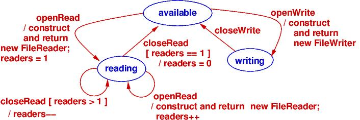

# Exercise: Design Patterns: Factories Methods (FM)

## Tasks

Study `readerwriter.classdiagram`, which shows how to use the FM pattern for
reading/writing files.   

Notice that methods `closeRead` and `closeWrite` of `FileController`  are
*private*. Also notice the delegate, `CloseOp`. 

Read the code for the factory methods: `openRead` and `openWrite`, to see how
the delegate is used.

Now rebuild and demo the code:  Write some lines to the file, close, and then
try to make both RThreads read the file at the same time --- it does not work!

Repair `FileController` so that both `RThread` objects can read the file at the
same time by implementing the "business logic" in the state diagram below (note:
readers is initially zero).

## Submission

To submit, copy the folder containing this file to your local GitHub repository
for the course, and then commit and push your modified solutions to GitHub
(see the [course note on Git/GitHub](http://softwarearch.santoslab.org/01-tooling/index.html#git-github)).

